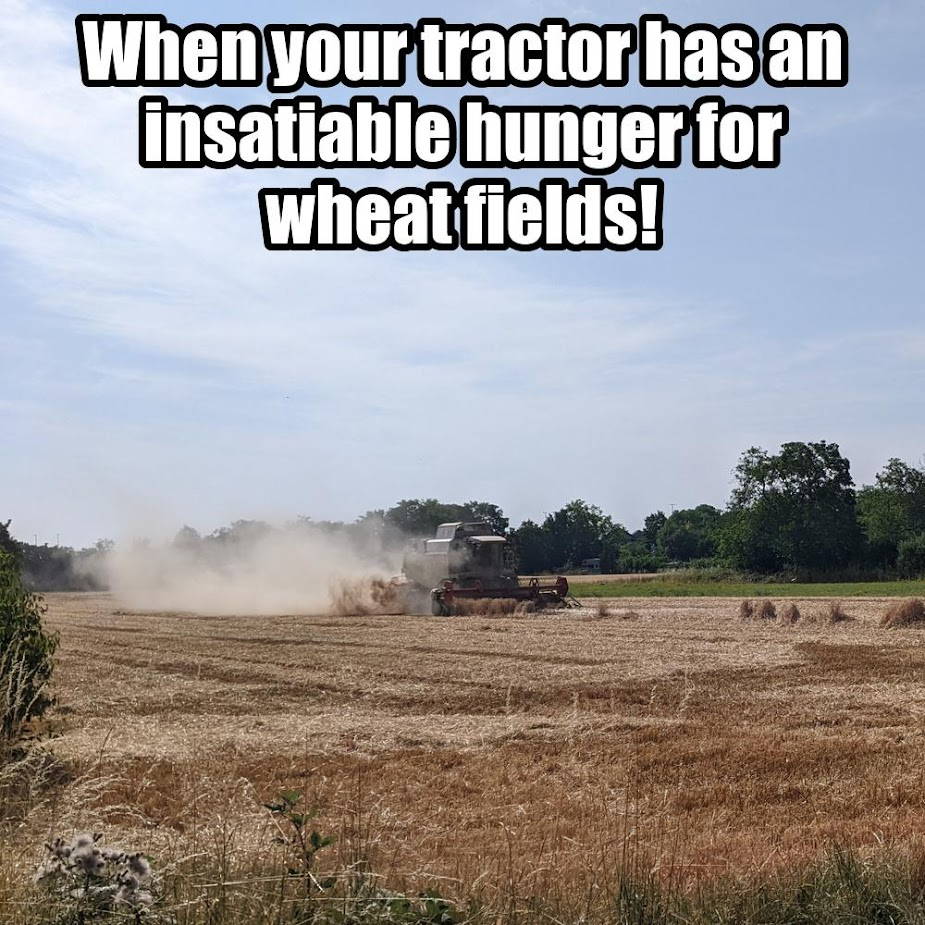
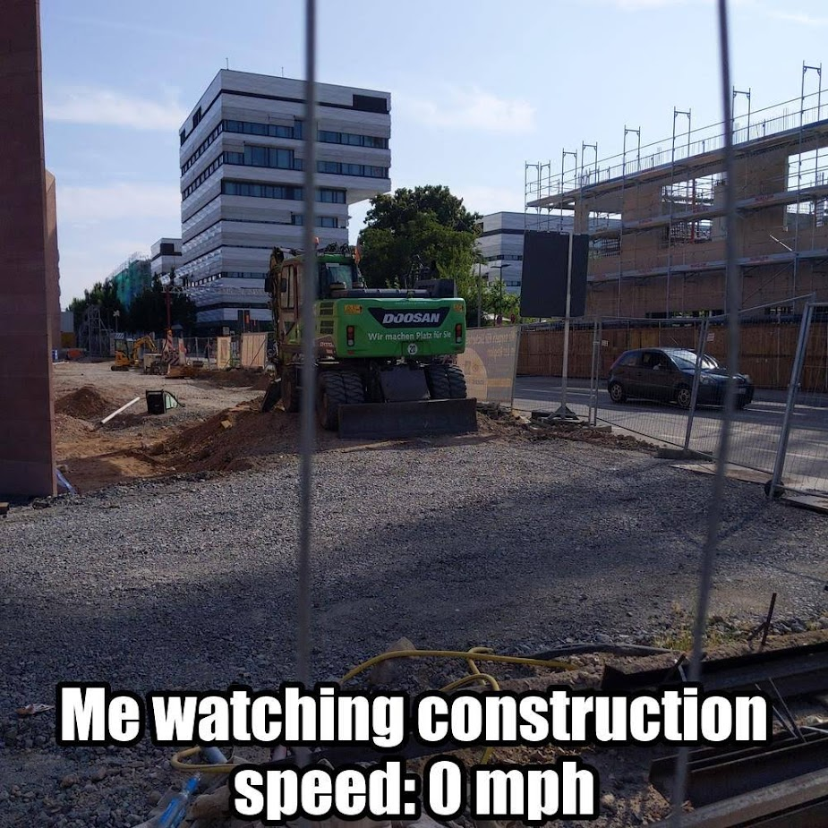
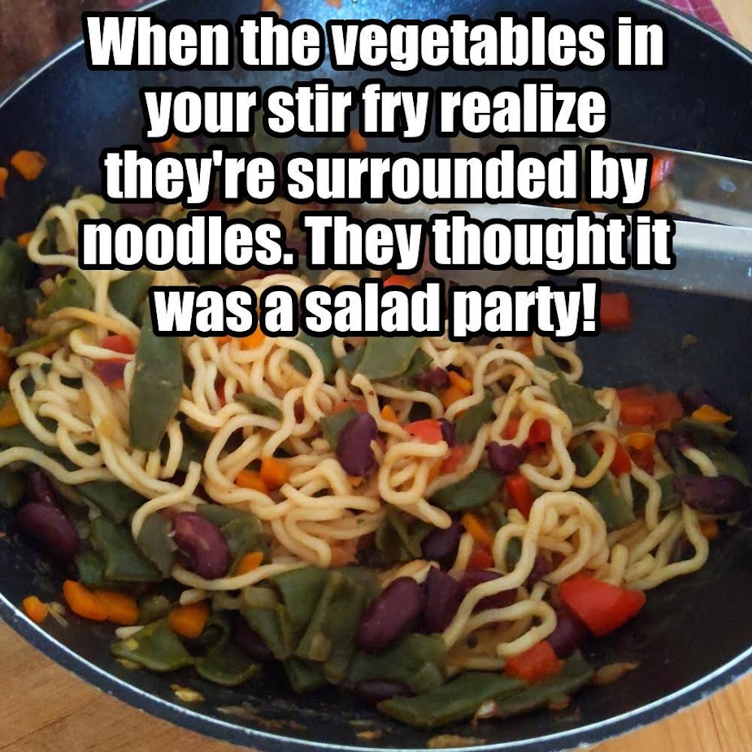

# AI Meme Generator

A meme generator using BLIP 2 and OpenAi's GPT Models.

## Process

1. Receive request via quarkus endpoint
2. Use torch on CUDA to run a BLIP 2 model to generate a caption for the image
3. Send to OpenAi's API with a request to generate a meme from the caption with given parameters
4. Add caption to initial image
5. Complete request by sending images back to user

## Prerequisites

- Python 3.X
- CUDA 11.8
- all packages in requirements.txt
- OpenAi API Key

## How to run

1. Insert your API key into the assignment `openai.api_key = ""` in `main.py`
2. Select a BLIP 2 model by setting the `blip2_model` variable in `main.py`
3. Select a GPT model by setting the `gpt_model` variable in `main.py`
4. Run `python main.py`
   1. This will download the selected BLIP 2 model (might take a while, the largest one is over 50 GB)
   2. Then the server will start on 0.0.0.0:5003

## Examples

